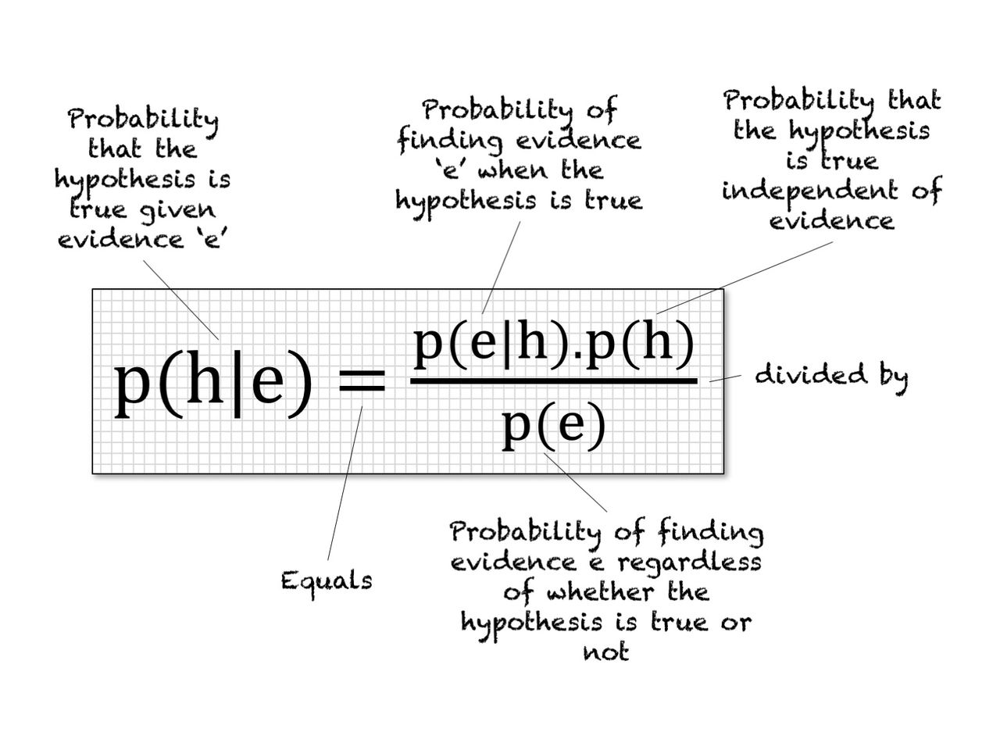

# Bayesian-Time-Series

Bayes' Theorem 

# Objective 

The goal of this repo is to explore and examine two A/B testing/inference frameworks: Frequentist and Bayesian. Bayesian Inference is proven to be powerful in terms of optimization and sampling method. Bayesian method incorporates historical data, is bias towards more recent events and resistant to outliers which helps to balance out odd days that have extremely low or high values or/and have inconsistent pattern with the rest of the dataset. There are three examples in which I compare and analyze the outcomes from both Frequentist and Bayesian

1. Udacity A/B Testing

2. Crime Rate in San Francisco groupby date and neighborhood

3. Taxi Pick up in New York groupby date and taxi company

# Frequentist approach

In Frequentist statistics, we assume the parameter(s) of interest are fixed constants. We focus on computing the likelihood prob(Data | Parameter), the probability we see the observed set of data points given the parameter of interest.

Methodology
  1. Declare hypotheses. Typically, the null hypothesis is that the new variant is no better than the incumbent. The alternative is the opposite.
  2. Determine a sample size in advance using a [statistical power calculation](https://clincalc.com/stats/samplesize.aspx), unless you’re using [sequential testing approaches](https://en.wikipedia.org/wiki/Sequential_analysis).
  3. Gather the data via a randomized experiment.
  4. Calculate the probability of observing a result at least as extreme as the data under the null hypothesis (p-value). Reject the null hypothesis and deploy the new variant to production if p-value < 5%.

Note:
Sample size: the calculation of an adequate sample size is a crucial aspect in the design of experiments. Inadequate sample size may lead to inaccurate results. However, if the sample size is too large, time and resources are wasted, often for minimal gain.

Confidence Interval: boundaries interval in which the true conversion rate falls with (say) 95% probability, which roughly means “If we would have repeated this test many times, and would have calculated a different confidence interval for each case, then in 95% of the times the actual conversion rate would fall within this interval.”

# Bayesian approach
In Bayesian statistics, we having uncertainty surrounding our parameter(s) of interest, and we mathematically capture our uncertainty about these parameters in a prior distribution, formally represented as prob(Parameter). We focus on computing the posterior distribution prob(Parameter | Data), representing our posteriori uncertainty surrounding the parameter of interest after we have observed data.

Methodology

1. Define the prior distribution that incorporates your subjective beliefs about a parameter. The prior can be uninformative or informative.
2. Gather data.
3. Update your prior distribution with the data using Bayes’ theorem (though you can have Bayesian methods without explicit use of Bayes’ rule—see non-parametric Bayesian) to obtain a posterior distribution. The posterior distribution is a probability distribution that represents your updated beliefs about the parameter after having seen the data.
4. Analyze the posterior distribution and summarize it (mean, median, sd, quantiles…).

### Why Bayes Rules?

- Prior belief: incorporate knowledge domain or expertise 
- Time: weighted on recency - the most recent values will be weighted more
- Smoothing effect: balance out outliers & rare events that have unexpected high numbers
- Quantify risk/uncertainty: have probability for every statement/decision including the magnitude of difference between options (2% increase)
- Sample size doesn’t matter
- Intuitive and interpretable

For Bayesians, probabilities are fundamentally related to their knowledge about an event. This means, for example, that in a Bayesian view, we can meaningfully talk about the probability that the true conversion rate lies in a given range, and that probability codifies our knowledge of the value based on prior information and/or available data.

# Frequentist vs Bayesian 

### False Positive Rate

- Testing at alpha = 0.05 means your statistical test yielding a result as extreme or more extreme by random chance (assuming a given null hypothesis is true) occurs with probability 0.05. 

- If you run 26 statistical tests, then an upper bound on the expected number of false positives is 26*0.05 = 1.3.

 This means in our above scenario, our data scientist can expect to have at least one false positive result, and unfortunately, the false positive result is the one she reported to her boss.

### Interpretability 

Instead of saying “we could not reject the null hypothesis that the conversion rate of A is equal to that of B with a p-value of 0.102,” we can state “there is a 89.1% chance that the conversion rate of A is better than B.”

We can attach business outcomes to each option with a degree of certainty. For example: there is  a 10% chance of losing money (200 thousand) with the new change, and a 89.1% chance of increasing the revenue (660 thousand).
